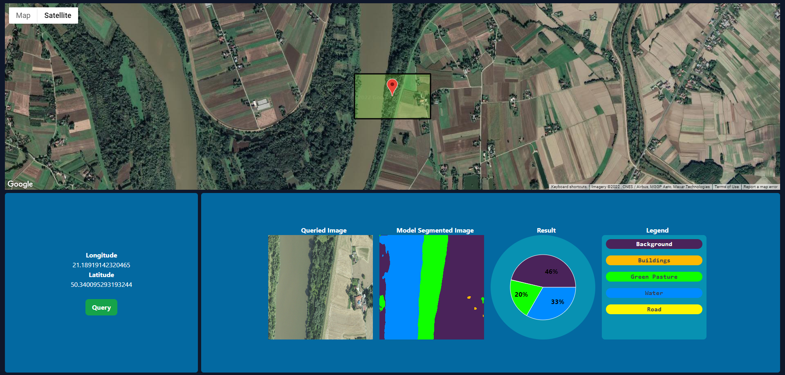

<div id="top"></div>


<br />
<div align="center">


  <h3 align="center">Web-Dashboard-for-Satellite-Image-Segmentation</h3>
  <p align="center">
   A dashboard style website that scrap satellite image, segment, and visualize its land use
    <br />
</div>


<!-- TABLE OF CONTENTS -->
<details>
  <summary>Table of Contents</summary>
  <ol>
    <li>
      <a href="#about-the-project">About The Project</a>
      <ul>
        <li><a href="#built-with">Built With</a></li>
      </ul>
    </li>
    <li>
      <a href="#getting-started">Getting Started</a>
      <ul>
        <li><a href="#prerequisites">Prerequisites</a></li>
        <li><a href="#installation">Installation</a></li>
      </ul>
    </li>
    <li><a href="#usage">Usage</a></li>
    <li><a href="#todo">Todo</a></li>
    <li><a href="#contributing">Contributing</a></li>
    <li><a href="#license">License</a></li>
  </ol>
</details>


<!-- ABOUT THE PROJECT -->
## About The Project


The main idea of this project is to construct a website that allows user to select an area on the satellite imagery map and to understand its land usage. This project utilize deep learning segementation model trained on Keras with dataset from <a href='https://landcover.ai/'>Land Cover</a>. There are a total of 5 land use classes for this model which are:
<ol>  
<li>Background (Unlabelled)</li>  
<li>Buildings</li>  
<li>Trees and greens</li>  
<li>Water</li>  
<li>Road</li>  
</ol>

<p align="right">(<a href="#top">back to top</a>)</p>

### Built With


<b>Frontend</b>💻

* [React.js](https://reactjs.org/)
* [Tailwind](https://tailwindcss.com/)
* [TypeScript](https://www.typescriptlang.org/)

<b>Backend</b>⚙️
* [Node.js](https://nodejs.org/en/)
* [Express](https://expressjs.com/)
* [TypeScript](https://www.typescriptlang.org/)

<b>Others</b>
* [Onnxruntime-node](https://www.npmjs.com/package/onnxruntime-node)
* [Selenium](https://www.npmjs.com/package/selenium-webdriver)
* [numjs](https://www.npmjs.com/package/numjs)
* [jimp](https://www.npmjs.com/package/jimp)

<p align="right">(<a href="#top">back to top</a>)</p>


<!-- GETTING STARTED -->
## Getting Started


### Prerequisites
Define the following in .env file as 'REACT_APP_GOOGLE_MAP_API_KEY' (Frontend folder) and 'WEB_URL' (Backend folder)respectively
<ul>
<li>A google map javascript API key
<li>Website URL to retrieve (256px x 256px)satellite image based on longitude and latitude. (Scrapping code needs to be modified accordingly)
</ul>

### Installation

Install all the dependencies and packages by navigating to the root(where package.json is located) of the Frontend and Backend folder and run the script below.


1. Clone the repo

  ```sh
   git clone https://github.com/ChengCK18/Web-App-for-Satellite-Image-Segmentation.git
   ```
  2. Install NPM packages for both folders
   ```sh
   npm install
   ```
  3. Start the application for both folders
   ```sh
    npm start
   ```
   


<p align="right">(<a href="#top">back to top</a>)</p>


<!-- USAGE EXAMPLES -->
## Usage

Press on the location of interest on the google map and press the query button to retrieve  the area of interest's satellite image and to segment its land usage.

<p align="right">(<a href="#top">back to top</a>)</p>

## Issues

<ol>
<li>The model was trained and tested on the dataset and achieve a decent result with IoU score of 0.7168 out of 1.000 but as expected, when the model is used to inference places out of Poland, and other parts of Central Europe(dataset origin), the model is unusable due to its poor performance. Factors include:
<ul>
	<li> Web scrapped satellite image quality is different from the dataset trained and validated upon.
	<li> Satellite images appears different based on different part of the world as images are taken by different satellite
	<li> Dataset used is not diversed as it only includes a small region.
	
</ul>

</ol>

<!-- ROADMAP -->
## Todo

- [ ] Improve model performance
- [ ] Error handling for server and frontend side
- [ ] Error caused by resizing process using setattribute which sometimes does not work causing image to be larger than input size of model
- [ ] Tidying up and refactoring code


<p align="right">(<a href="#top">back to top</a>)</p>


<!-- CONTRIBUTING -->
## Contributing
Any contributions you make are **greatly appreciated**.

If you have a suggestion that would make this better, please fork the repo and create a pull request. You can also simply open an issue with the tag "enhancement".
Don't forget to give the project a star! Thanks again!

1. Fork the Project
2. Create your Feature Branch (`git checkout -b feature/AmazingFeature`)
3. Commit your Changes (`git commit -m 'Add some AmazingFeature'`)
4. Push to the Branch (`git push origin feature/AmazingFeature`)
5. Open a Pull Request

<p align="right">(<a href="#top">back to top</a>)</p>


<!-- LICENSE -->
## License

Distributed under the MIT License

<p align="right">(<a href="#top">back to top</a>)</p>
